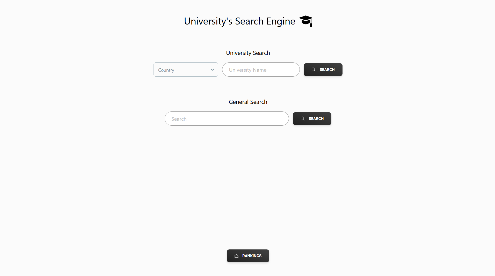
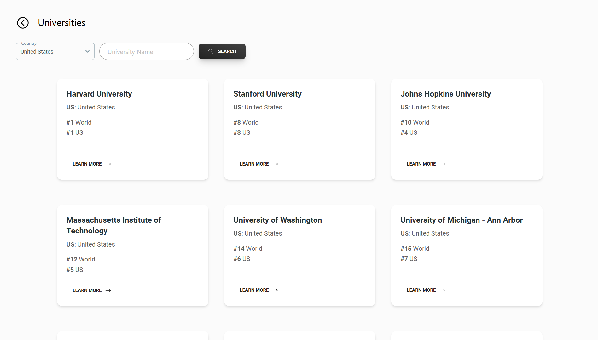
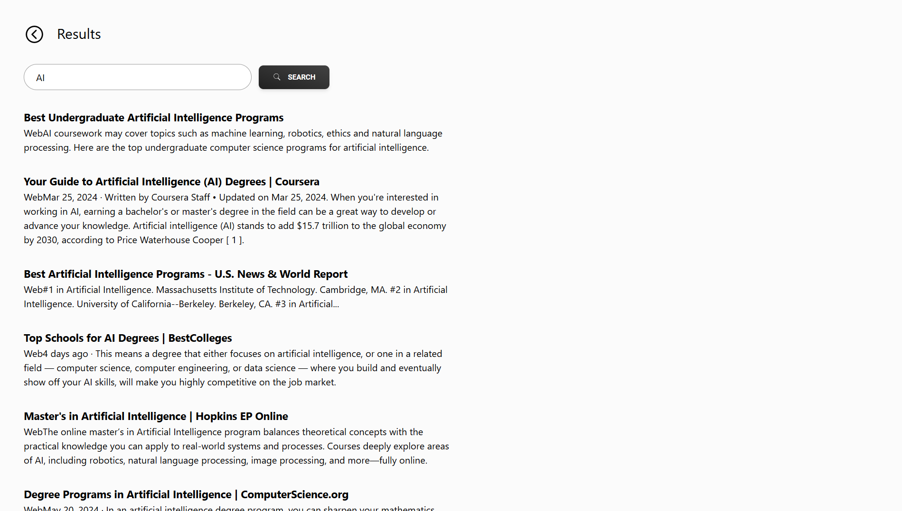
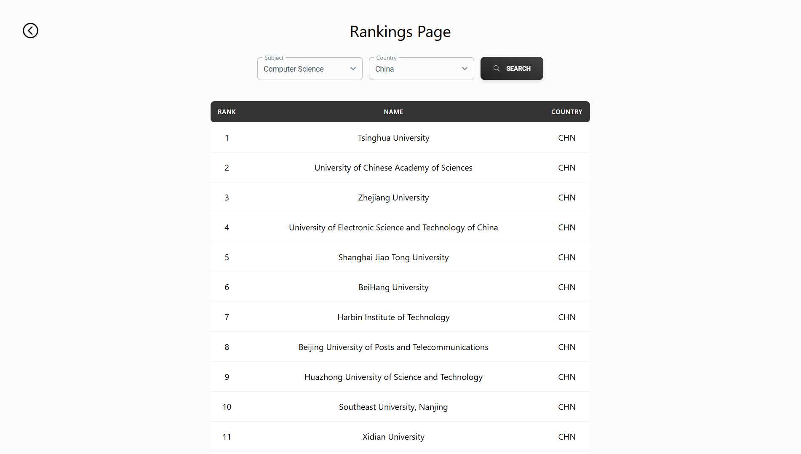

# university-search-engine

This project consists in a Search Engine with Universities as the theme. It has 3 main features, **Universities List**, **General Search**, and **Rankings**.

-   **Universities List** - Retrieves the list of all Universities based on the input (Country and University's name);
-   **General Search** - A normal web search as in normal SE's, the main difference is that the results are going to be university/related related;
-   **Rankings** - Updated rankings per country and subject.

|                          **Main Page**                          |                               **Universities List Page**                                |
| :-------------------------------------------------------------: | :-------------------------------------------------------------------------------------: |
|  |  |

|                           **General Search Page**                            |                            **Rankings Page**                            |
| :--------------------------------------------------------------------------: | :---------------------------------------------------------------------: |
|  |  |

## Tech Stack

University's Search Engine was made with the following Tech Stack:

-   [Python](https://www.python.org/) - A versatile programming language used for the backend development, and data processing;
-   [Flask](https://flask.palletsprojects.com/en/3.0.x/) - A python framework to build API's;
-   [React.js](https://react.dev/) - A JavaScript Framework for Web Development;
-   [Tailwind CSS](https://tailwindcss.com/) - A CSS Framework.

## Running Instructions:

-   **Install requirements:**

    -   To install the **backend's requirements** navigate to the backend folder `cd backend`, then install the requirements `pip install -r requirements.txt`;
    -   To install the **frontend's requirements**, which is built in React, you have to install the latest versions of **Node.js** and **npm**, then you should run `npm i` to install all of its requirements (in the root).

-   **Run the backend:**

    -   Navigate to backend's folder `cd backend`;
    -   Run the server's API `python3 app.py`.

-   **Run the frontend:**
    -   Open another terminal (in the root of the project), and run `npm start`.

## For Better Performance:

This project is done to run in 2 different ways:

-   Load data directly from the **source**;
-   Load data from local **csv files**.

By default the 1st one is being used, however if you want to experience better performance you can choose the 2nd one.

To change from the 1st option to the 2nd, you just have to:

-   `cd backend`;
-   `python3 fill_csv_files.py`, to generate the csv files;
-   Open the file `backend/app.py` and change the 1st variable from `load_from_csv = False` to `load_from_csv = True`.

With this change you will experience better performance, however don't forget to update the csv files regularly.

## Dependencies

University's Search Engine relies on the following external API's and libraries:

-   [Hipo/university-domains-list-api](https://github.com/Hipo/university-domains-list-api) - This API is used to retrieve all the universities;
-   [Scimago Institution Rankings](imagoir.com/rankings.php?sector=Higher+educ.) - This website is the source of the rankings.

## License

[MIT License](LICENSE)
